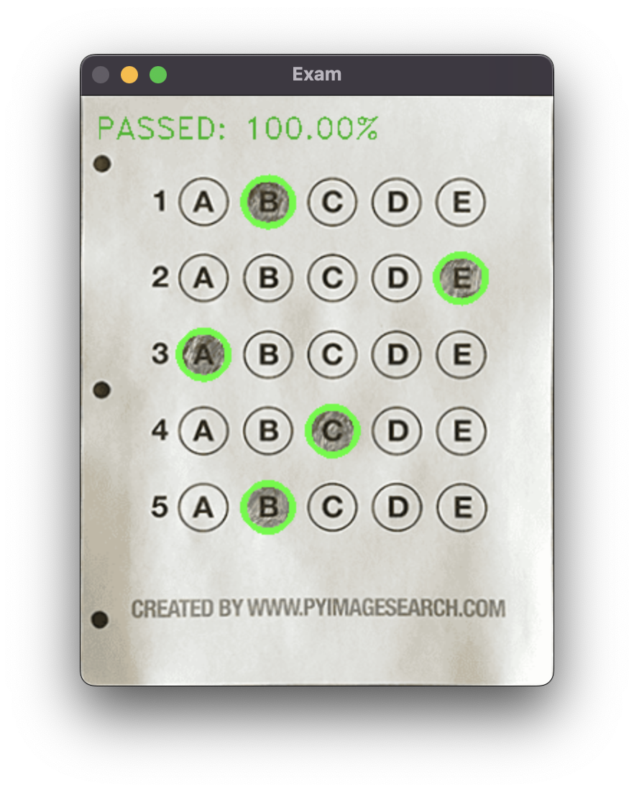
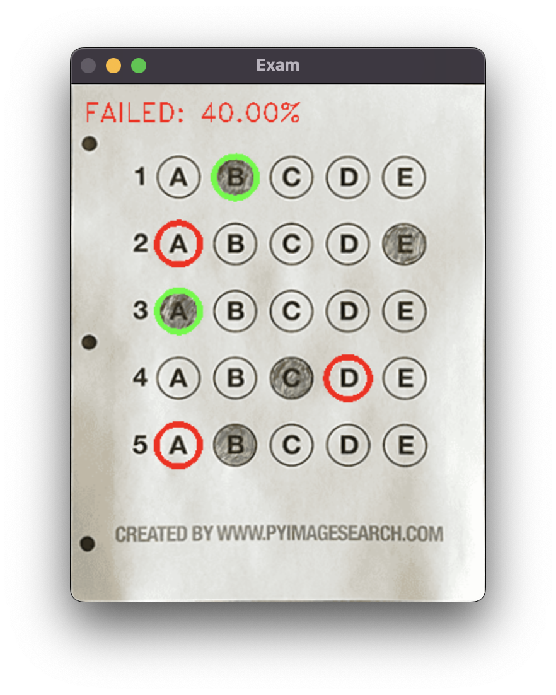
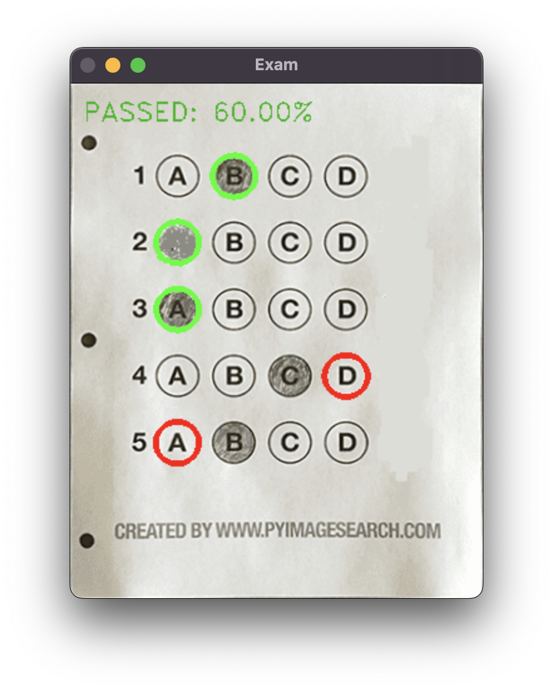
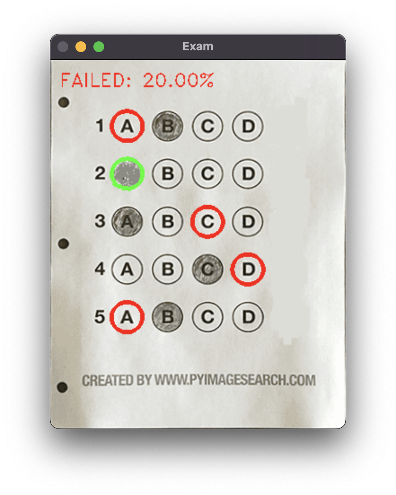

# Multiple Choice Scanner using OMR, OpenCV and Python

**Implementation steps:**
1. Load the exam paper by providing path to the image.
2. Convert image to grayscale, blur it to reduce high frequency noise, then find edges
3. Apply a perspective transform to extract the top-down, birds-eye-view of the exam.
4. Extract the set of bubbles (the possible answer choices) from the perspective transformed exam.
5. Sort the questions/bubbles into rows.
6. Determine the marked answer for each row.
7. Lookup the correct answer in our answer key to determine if the user was correct in their choice.
8. Repeat for all questions in the exam

## Test Cases:

### Using 5 choices format (A-E):

| Success       | Fail          |
| ------------- | ------------- |
|  |   |

### Using 4 choices format (A-D):

| Success       | Fail          |
| ------------- | ------------- |
|  |   |

## FAQ
* Does it works with questions more than 5?
  - Yes, just update the admin section in [testGrader.py](testGrader.py) file
* Can I use multiple row number format sheet?
  - Unfortunately, the code haven't support this feature yet

## Known limitation:
* Not compatible with multiple row number format sheet
* Not compatible with low-res image

## future updates:
* detect student's name 

